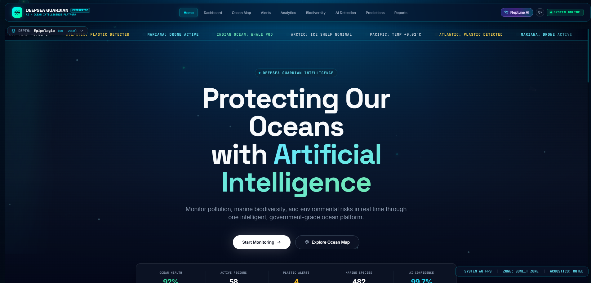
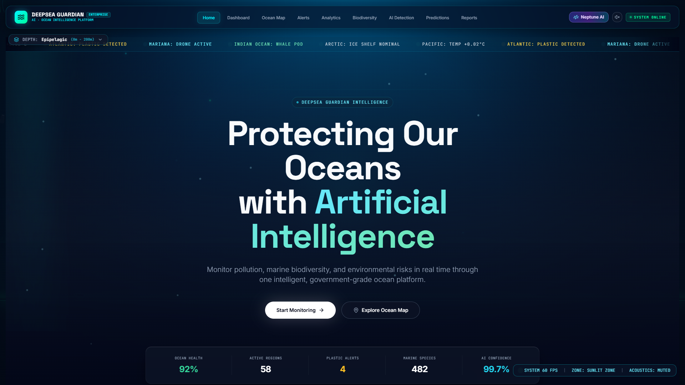
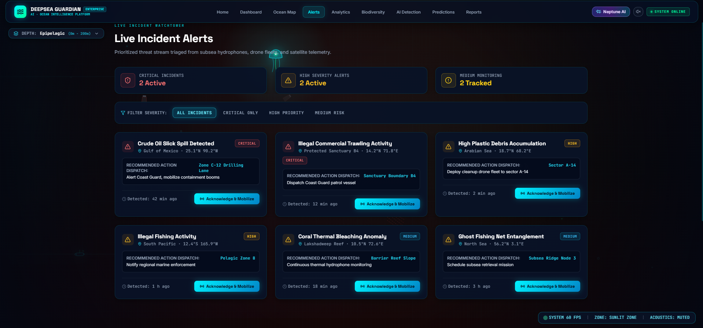
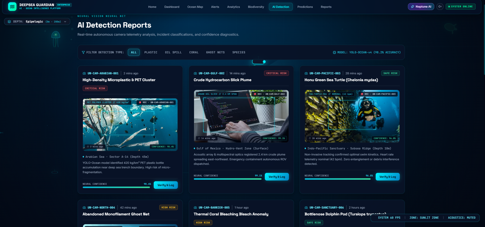
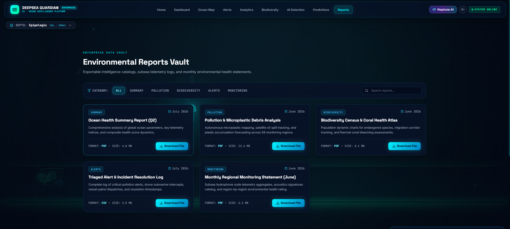
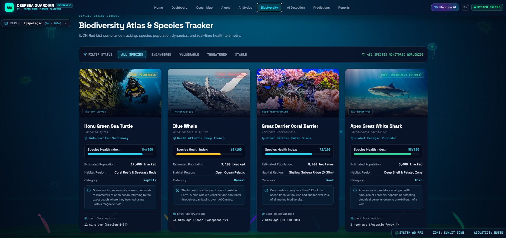
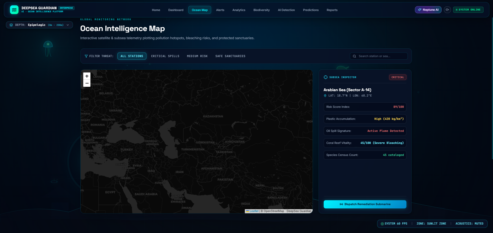
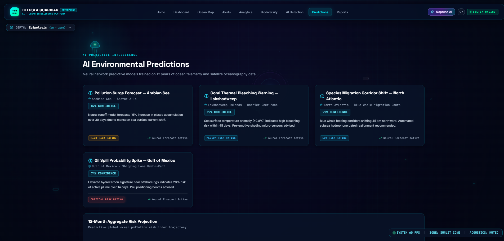

# 🌊 DeepSea Guardian



**DeepSea Guardian** is an enterprise-grade, AI-powered ocean monitoring platform designed to safeguard marine biodiversity and track subsea telemetry in real-time. Built with modern web technologies, it serves as a global command center for researchers, governments, and environmental organizations to combat ocean pollution and protect vulnerable species.

## ✨ Features

- **Live Ocean Telemetry:** Real-time data streaming of temperature, salinity, and acoustic metrics across 58 global monitoring stations.
  <br>
  

- **AI-Powered Detection:** Advanced simulated neural networks that analyze sub-surface drone feeds to instantly identify plastic waste, illegal fishing, and crude oil plumes.
  <br>
  

- **AI Detection Reports:** Real-time autonomous camera telemetry analysis, incident classifications, and confidence diagnostics.
  <br>
  

- **Environmental Reports Vault:** Exportable intelligence catalogs, subsea telemetry logs, and monthly environmental health statements.
  <br>
  

- **Marine Biodiversity Tracking:** Non-invasive monitoring of coral reefs, whale pods, and deep-sea aquatic life using acoustic tagging.
  <br>
  

- **Interactive Explorer Module:** Explore the three core pillars powering the DeepSea Guardian marine intelligence initiative, such as the Rainforests of the Sea.
  <br>
  

- **Predictive Analytics:** Real-time 12-Month Risk Trajectory Matrix and forecast modeling.
  <br>
  

- **Cinematic UI/UX:** A highly immersive, 60-FPS futuristic dashboard built with Framer Motion, featuring interactive bioluminescent cursors, global sonar scans, and 3D hover effects.
- **Neptune AI Commander:** An integrated AI assistant capable of processing complex oceanographic queries and generating localized threat reports.

## 🛠️ Tech Stack

- **Frontend Framework:** React 18 & Vite
- **Styling:** Tailwind CSS (Dark Mode / Glassmorphism)
- **Animations:** Framer Motion (Physics-based springs, interactive motion tracking)
- **Routing:** React Router v6
- **Icons:** Lucide React

## 🚀 Getting Started

### Prerequisites
Make sure you have [Node.js](https://nodejs.org/) installed on your machine.

### Installation

1. **Clone the repository:**
   ```bash
   git clone https://github.com/your-username/Deep-Sea---HackOcean.git
   cd Deep-Sea---HackOcean
   ```

2. **Install dependencies:**
   ```bash
   npm install
   ```

3. **Start the development server:**
   ```bash
   npm run dev
   ```

4. **Open in Browser:**
   Navigate to `http://localhost:3000` to view the application.

## 📂 Project Structure

```
Deep-Sea---HackOcean/
├── src/
│   ├── components/       # Reusable UI components (Navbar, Modals, etc.)
│   ├── pages/            # Core views (Home, Dashboard, OceanMap, Alerts, etc.)
│   ├── utils/            # Helper functions and audio utilities
│   ├── index.css         # Global styles and custom CSS animations
│   ├── App.jsx           # Main application routing and global layout
│   └── main.jsx          # React DOM mounting point
├── public/               # Static assets (images, fonts, etc.)
├── package.json          # Project metadata and dependencies
└── tailwind.config.js    # Tailwind CSS configuration
```

## 🎨 Design Philosophy

DeepSea Guardian takes inspiration from high-end SaaS platforms and cinematic sci-fi interfaces. It avoids generic designs by utilizing:
- **Immersive Micro-interactions:** Buttons and cards that physically tilt and respond to cursor movement.
- **Background Ecosystems:** Pure CSS and SVG-based background animals (Sea Turtles, Jellyfish, Fish Schools) that bring the application to life.
- **Responsive Layout:** A flawlessly robust grid system that prevents horizontal overflow on any device.

## 📝 License

This project is open-source and available under the [MIT License](LICENSE).

---
*Built with ❤️ for HackOcean.*
